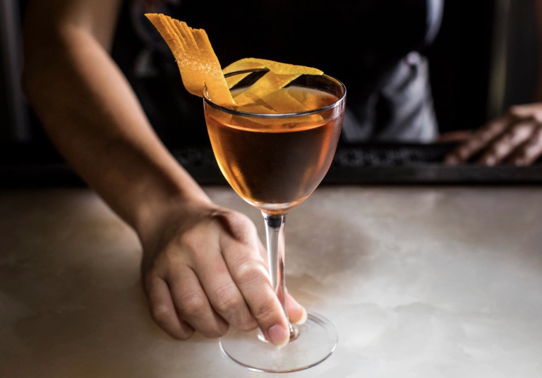
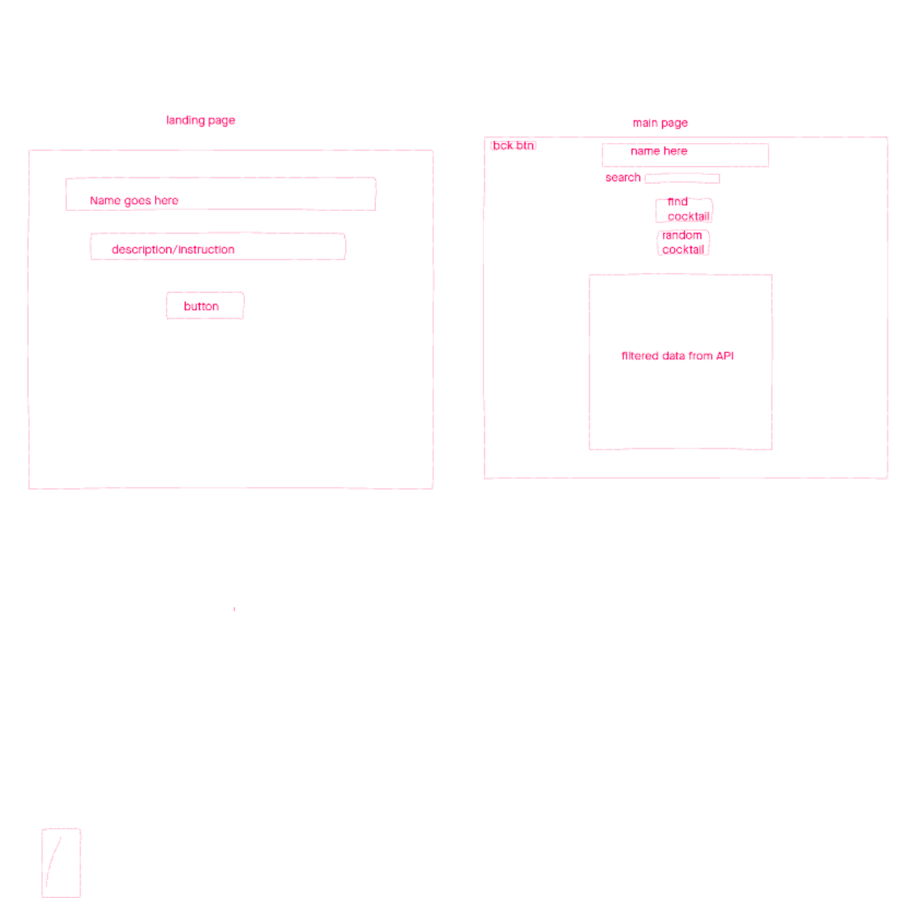

# Luckey cocktail-finder
### Cocktail Finder Website Using API
#### by Schuyler (Skyler) Luckey




## COCKTAILDB API
 #### This website utilizes the thecocktaildb API to allow users to search for the ingredient list and build process for almost any cocktail you can think of. 
 #### If the user cannot even begin to decide on a cocktail that they want. The website also has a feature for a "I'm feeling lucky" option where the user can click the button which returns a random cocktail.

 * https://www.thecocktaildb.com/api.php

 ```javascript
   {
drinks :[
{
idDrink : "12402" ,
strDrink : "Tom Collins" ,
strCategory : "Ordinary Drink" ,
strAlcoholic : "Alcoholic" ,
strGlass : "Collins glass" ,
str Instructions : "In a shaker half-filled with ice cubes, combine the gin, lemon juice, and sugar. Shake well. Strain into a collins glass alomst filled with ice cubes. Add the club soda. Stir and garnish with the cherry and the orange slice. " ,
strInstructionsDE : " Mix the gin, lemon juice and sugar in a shaker that is half filled with ice cubes. Shake well. Strain into a Collins glass that is filled with ice cubes. Add the club soda. Stir and stir with the cherry and Garnish with the orange slice. " ,
strDrinkThumb : " https://www.thecocktaildb.com/images/media/drink/qystvv1439907682.jpg " ,
strIngredient1 : "Gin" ,
strIngredient2 : "Lemon juice" ,
strIngredient3 : "Sugar" ,
strIngredient4 : "Club soda" ,
strIngredient5 : "Maraschino cherry" ,
strIngredient6 : "Orange" ,
strMeasure1 : "2 oz" ,
strMeasure2 : "1 oz" ,
strMeasure3 : "1 tsp superfine" ,
strMeasure4 : "3 oz" ,
strMeasure5 : "1" ,
strMeasure6 : "1" ,
}
]
}
 ```

## GOALS
* To minimize user effort in deciding on what cocktail they want
* To help bartenders with undecided customers by telling them to check out Luckeycocktailfinder.com (domain rights pending)
* To provide a fun drink choosing expierience

## my wire frame
<!--  -->
## TECHNOLOGY USED

* [img source](https://www.google.com/url?sa=i&url=https%3A%2F%2Fwebinlinedev.com%2Fwhat-are-html-css-and-javascript-and-what-can-you-do-with-it%2F&psig=AOvVaw1-XjGGdkEQON3tzeaMUvBQ&ust=1603135692357000&source=images&cd=vfe&ved=0CAMQjB1qFwoTCPjj-YDwvuwCFQAAAAAdAAAAABAT)

## Credits:
Schuyler Luckey   [GitHub](https://github.com/Gnarlyluck) | [linkedin](https://www.linkedin.com/in/schuyler-luckey-aab1401ba/)
* My teachers and fellow students at [General Assembly](https://generalassemb.ly/)
#### To stay organized I used Trello 
* [My Trello board](https://trello.com/b/MKmMa9e0/cocktail-finder)